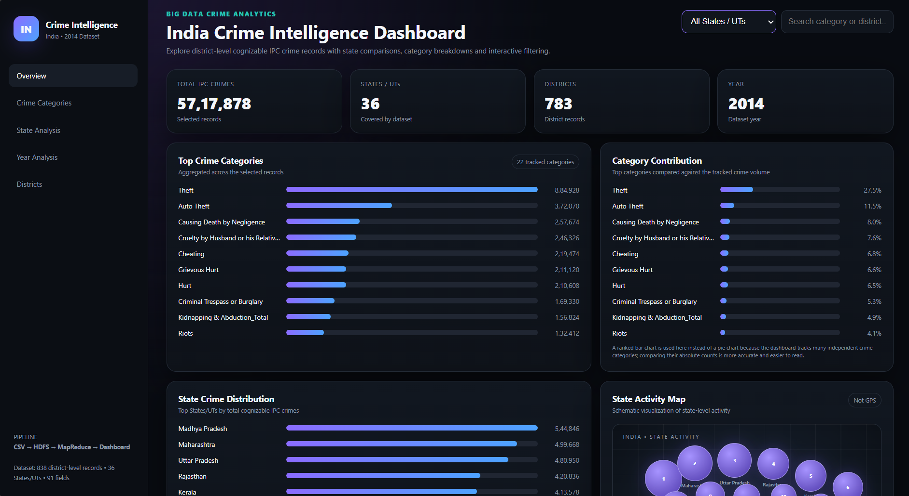
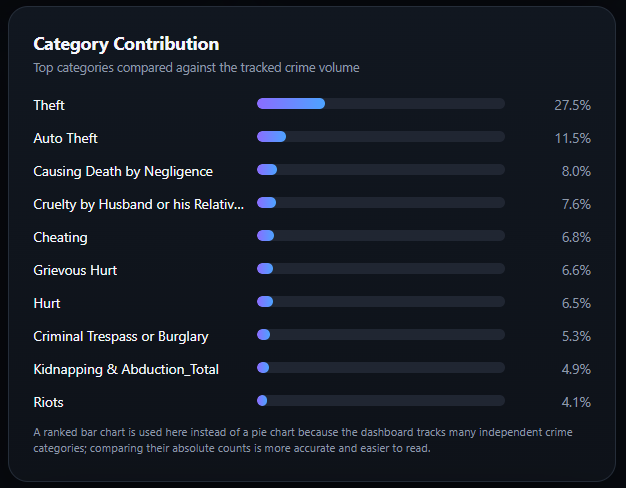
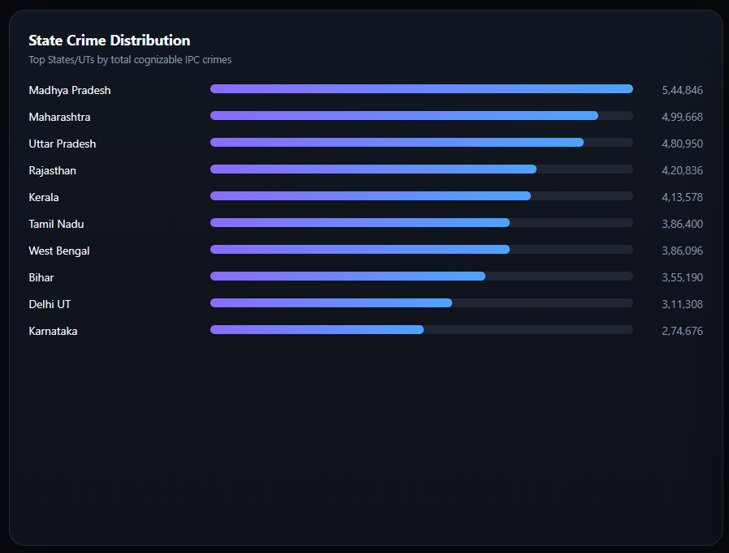
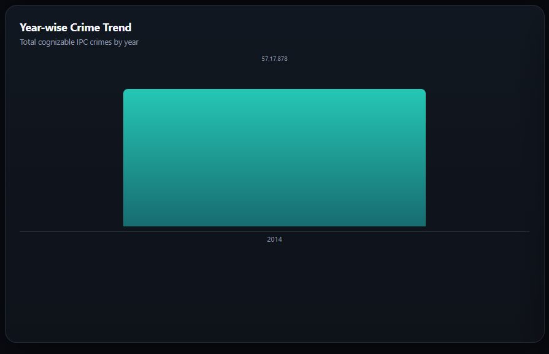
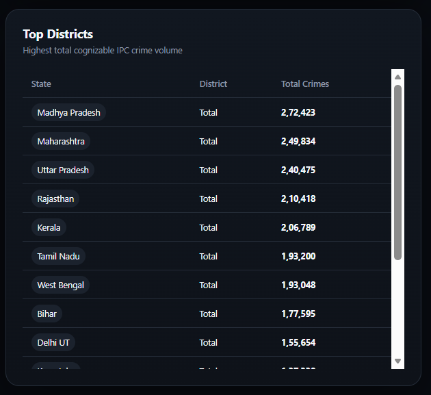

# 🔍 Crime Data Analysis using Hadoop & Interactive Dashboard


> **An end-to-end Big Data crime analytics project that uses Hadoop MapReduce to process district-level crime data and an interactive web dashboard to explore crime patterns across India.**

[🚀 **Live Dashboard**](https://0403darknight.github.io/Crime-Data-Analysis-using-Hadoop-Interactive-Dashboard/)

---

## 📌 Project Overview

Crime datasets can contain thousands of records across different states, districts, crime categories, and years. Analysing this information manually makes it difficult to identify patterns and compare regions.

This project demonstrates a simple **Big Data analytics pipeline** that:

* Processes crime data using **Hadoop MapReduce**
* Aggregates crime records by **state, category, year, and district**
* Converts the processed results into dashboard-ready data
* Presents the findings through an **interactive web dashboard**
* Provides filters and visual summaries for easier exploration

The project uses an **India crime dataset containing district-level cognizable IPC crime records**.

---

## 🎯 Objectives

* Analyse crime distribution across Indian states and districts
* Identify the most frequently reported crime categories
* Compare crime volumes between states
* Provide an interactive way to explore the dataset
* Demonstrate the use of **HDFS and MapReduce** for crime-data processing

---

## 🛠️ Technology Stack

| Component           | Technology                                 |
| ------------------- | ------------------------------------------ |
| Big Data Processing | Hadoop, HDFS, MapReduce                    |
| Programming         | Python                                     |
| Data                | CSV                                        |
| Dashboard           | HTML, CSS, JavaScript                      |
| Visualization       | Interactive charts & custom visualizations |
| Version Control     | Git & GitHub                               |
| Deployment          | GitHub Pages                               |

---

## 🔄 How the Project Works

```text
                 Crime Dataset
                      │
                      ▼
                CSV Input Data
                      │
                      ▼
                    HDFS
                      │
                      ▼
              ┌───────────────┐
              │ Hadoop        │
              │ MapReduce     │
              └───────────────┘
                 │         │
          Mapper │         │ Reducer
                 ▼         ▼
          Extract &      Aggregate
          group data     crime counts
                 │         │
                 └────┬────┘
                      ▼
             Processed CSV Output
                      │
                      ▼
             Interactive Dashboard
                      │
          ┌───────────┼───────────┐
          ▼           ▼           ▼
       Categories   States     Districts
                      │
                      ▼
                Crime Insights
```

### MapReduce Workflow

**Mapper**

The mapper reads each crime record and emits key-value pairs based on the required analysis, such as:

```text
State → Crime Count
Crime Category → Count
District → Count
Year → Count
```

**Reducer**

The reducer receives grouped keys and aggregates the corresponding values to produce summarized crime statistics.

These processed results are then used by the dashboard.

---

## 📊 Dashboard

The dashboard provides a simple interface for exploring the processed crime data.

### Overview



The overview provides:

* Total IPC crimes
* Number of States/UTs
* Number of districts
* Dataset year
* Top crime categories
* State-level crime distribution
* Category contribution

### Crime Categories



The dashboard ranks crime categories by total recorded volume, making it easier to compare categories with different frequencies.

### State Analysis



State-level analysis allows users to compare the total cognizable IPC crime volume across different States/UTs.

### Year Analysis



The dataset used in this project represents **2014**, so the visualization shows the crime volume associated with that dataset year.

### District Analysis



The district section provides a ranked view of crime volume across the available district-level records.

---

## 🔎 Key Insights

The analysis highlights several patterns in the dataset:

* **Theft** is the largest individual crime category in the analysed dataset.
* **Auto Theft** is another significant contributor to the overall crime volume.
* Crime volume varies considerably between States/UTs.
* States such as **Madhya Pradesh, Maharashtra, Uttar Pradesh, and Rajasthan** appear among the highest-volume regions in the dashboard.
* District-level aggregation allows regional crime patterns to be compared more easily.

> **Note:** These observations describe the dataset and should not be interpreted as current crime rates or crime risk for a population. The dataset represents recorded crime data for the specified year.

---

## 📁 Project Structure

```text
Crime-Data-Analysis-using-Hadoop-Interactive-Dashboard/
│
├── index.html
├── README.md
├── LICENSE
│
├── input/
│   └── crime_data.csv
│
├── mapreduce/
│   ├── state_crime_mapper.py
│   └── state_crime_reducer.py
│
├── output/
│   ├── crime_by_state.csv
│   ├── crime_by_year.csv
│   ├── crime_category_summary.csv
│   └── top_districts.csv
│
└── screenshots/
    ├── dashboard_overview.png
    ├── crime_categories.png
    ├── state_analysis.png
    ├── year_analysis.png
    └── district_analysis.png
```

---

## 🚀 How to Run

### 1. Clone the repository

```bash
git clone https://github.com/0403darknight/Crime-Data-Analysis-using-Hadoop-Interactive-Dashboard.git
cd Crime-Data-Analysis-using-Hadoop-Interactive-Dashboard
```

### 2. Run the Hadoop MapReduce pipeline

Upload the dataset to HDFS:

```bash
hdfs dfs -mkdir /crime_input
hdfs dfs -put input/crime_data.csv /crime_input
```

Run the Hadoop Streaming job:

```bash
hadoop jar /usr/lib/hadoop-mapreduce/hadoop-streaming.jar \
-input /crime_input/crime_data.csv \
-output /crime_output \
-mapper "python3 mapreduce/state_crime_mapper.py" \
-reducer "python3 mapreduce/state_crime_reducer.py"
```

Retrieve the output:

```bash
hdfs dfs -get /crime_output output/
```

### 3. Open the dashboard locally

From the project directory:

```bash
python3 -m http.server 8000
```

Then open:

```text
http://localhost:8000/
```

---

## 🌐 Live Demo

The dashboard is deployed using GitHub Pages:

### 🚀 [Open the Live Dashboard](https://0403darknight.github.io/-Crime-Data-Analysis-using-Hadoop-Interactive-Dashboard/)

The live version allows visitors to explore the dashboard without installing Hadoop locally.

---

## 💡 Project Highlights

**Problem →** Large crime datasets are difficult to analyse manually.

**Method →** Hadoop HDFS + MapReduce for distributed data processing and aggregation.

**Output →** Processed crime statistics grouped by relevant dimensions.

**Visualization →** Interactive web dashboard for exploring categories, states, years, and districts.

**Impact →** Converts raw crime records into an accessible analytical interface that makes patterns easier to identify and communicate.

---

## 📌 Limitations

* The current dataset represents **2014**, so it should not be treated as a current crime-monitoring system.
* The dashboard is primarily a visualization layer; Hadoop processing is performed separately.
* Recorded crime volume does not necessarily represent the actual incidence of crime because reporting and recording practices can vary.

---

## 🔮 Future Improvements

* Add multi-year datasets for actual trend analysis
* Add advanced geographic heatmaps
* Integrate real-time or periodically updated datasets
* Add predictive crime analytics
* Add demographic and socioeconomic factors
* Deploy a backend for automated Hadoop/ETL processing

---

## 👩‍💻 Author

**Dhiksha C G**
Computer Science (Data Science)

🔗 GitHub: [@0403darknight](https://github.com/0403darknight)

---

## 📄 License

This project is licensed under the **MIT License**.
